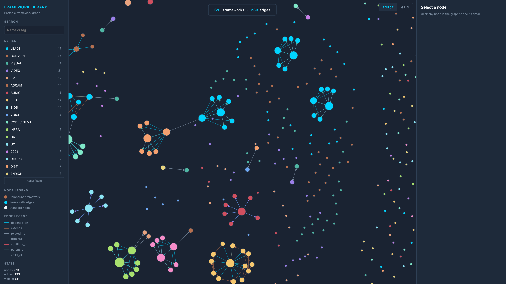

# Portable Framework Format

An open standard for reusable thinking systems.

## The problem

Frameworks currently live trapped inside specific AI conversations. Your systematic thinking, the methodologies, decision trees, and reusable mental models you've built through thousands of exchanges, stays locked to whichever platform hosted the conversation.

There's no portable format. No interoperability. No way to move your intelligence between tools, share it with teammates, or version it like code.

Every time you switch AI systems, you start over. Every time a company changes their terms, your thinking goes with them. Every team reinvents the same frameworks because nobody can share them in a structured way.

This is the missing standard.

## What this is

A `.framework.json` file is a portable, self-contained description of a single reusable framework, a systematic thinking tool that can be loaded into any AI system, shared across teams, or versioned like code.

The format is designed so that:

- Any tool can read a framework without additional context.
- Relationships between frameworks are explicit and graph-traversable.
- A human can open the file in any editor and understand it.
- Frameworks survive round-tripping between systems with no structural loss.

This spec is derived from a library of 611 frameworks built over two years. It formalizes what was already working.



## What's in this repo

- `SPECIFICATION.md`, the full format spec
- `examples/`, four example frameworks showing the format in practice
- `tools/`, Python CLI for ingesting, searching, exporting, and graphing a framework library (standard library only, no dependencies)
- `graph.html`, visual explorer for navigating framework relationships

## The examples

| File | What it shows |
|------|--------------|
| `minimal-example.framework.json` | Smallest valid file. Every required field at its minimum form. |
| `full-example.framework.json` | Every optional block. FILM-007 in canonical form. |
| `render-004-example.framework.json` | Production framework. Audio-visual video production pipeline. |
| `scope-community-example.framework.json` | Collaboration framework. AI partnership calibration. |

## Quick start

```bash
# Ingest a folder of framework files into SQLite
python3 tools/ingest.py --source ./examples --db library.db

# Search the library
python3 tools/search.py --db library.db --text "production"

# Export back to canonical .framework.json files
python3 tools/export.py --db library.db --out ./exported

# Generate relationship graph JSON
python3 tools/graph.py --db library.db --out graph.json

# Open visual graph explorer
open graph.html
```

## What's next

- Conversation export extraction tools (turn Claude or ChatGPT history into structured frameworks).
- Expanded relationship enrichment for the canonical library.
- Community framework submission process.
- Integration examples for popular AI systems.

Contributions welcome. This is early infrastructure and the standard will evolve through real-world use.

## Related

- [Framework Builder](https://github.com/framework-creator/framework-builder), open source skill file for building frameworks using this format.
- [whatisaframework.com](https://whatisaframework.com), methodology and educational content explaining framework thinking.
- [howtoframework.com](https://howtoframework.com), practical guidance on building your own frameworks.

## About

Built by Mike Goetz. Derived from two years of systematic framework development and the SIOS Strategic Intelligence Operating System project.

## License

MIT. The spec, tools, and examples are free to use, modify, and distribute.
